# Tutorial: Deploy a SQL Managed Instance on Azure Kubernetes Service on Azure Stack HCI

By the end of this tutorial, you will have an AKS on Azure Stack HCI cluster deployed with an Azure Arc Data Controller, Azure SQL MI with a sample database. This tutorial assumes a basic understanding of Kubernetes concepts. For more information, see [Kubernetes core concepts for Azure Kubernetes Service on Azure Stack HCI](kubernetes-concepts.md).

This tutorial assumes a basic understanding of SQL databases and Kubernetes concepts. 

## Before you begin

Verify you have the following requirements ready:

On your Azure Stack HCI environment,
* An Azure Kubernetes Service on Azure Stack HCI cluster with ONLY Linux worker nodes that is up and running. 
* A kubeconfig file to access the cluster.

On your client (Desktop or Virtual Machine),
* Azure Data Studio
* Azure CLI
* Azure Data CLI
* Kubectl

### Part 1: Generate a deployment file

In the Azure Arc Resources menu in portal.azure.com, select the Data Controllers (Preview) option. You will see an option to create a new Azure Arc data controller.

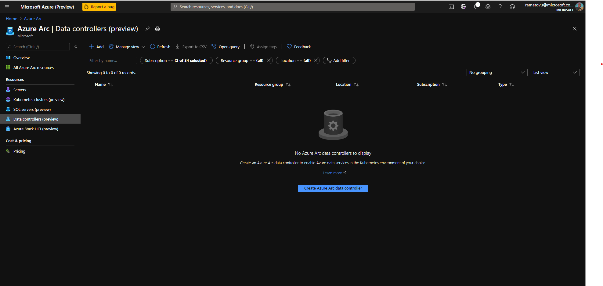

When you click on the Create Azure Arc data controller button, you will be presented with a list of prerequisites to install on your client. Make sure you have these installed on your client. 

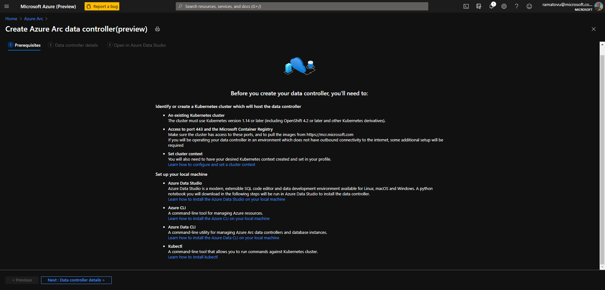

On the data controller details tab, enter the Azure subscription information, pick a name for your data controller and select azure-arc-aks-hci option from the configuration profile menu. Click Next

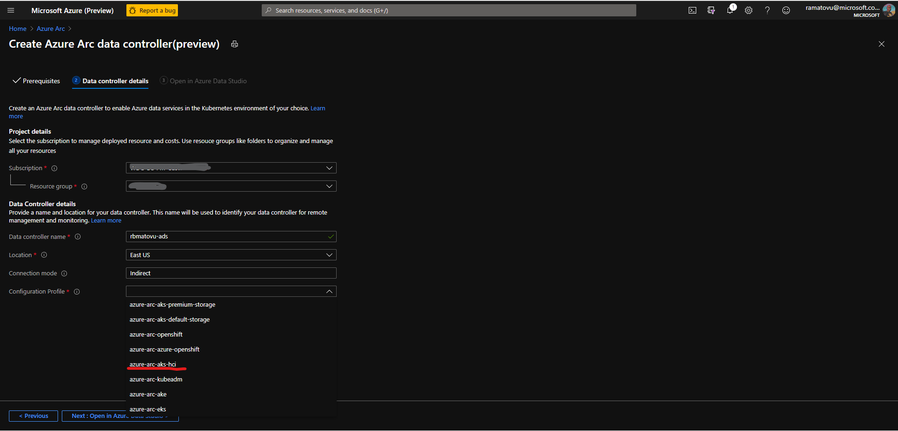

On the Open in Azure Data Studio tab, click on Download provisioning notebook to generate and download the Jupyter Notebook  setup file.

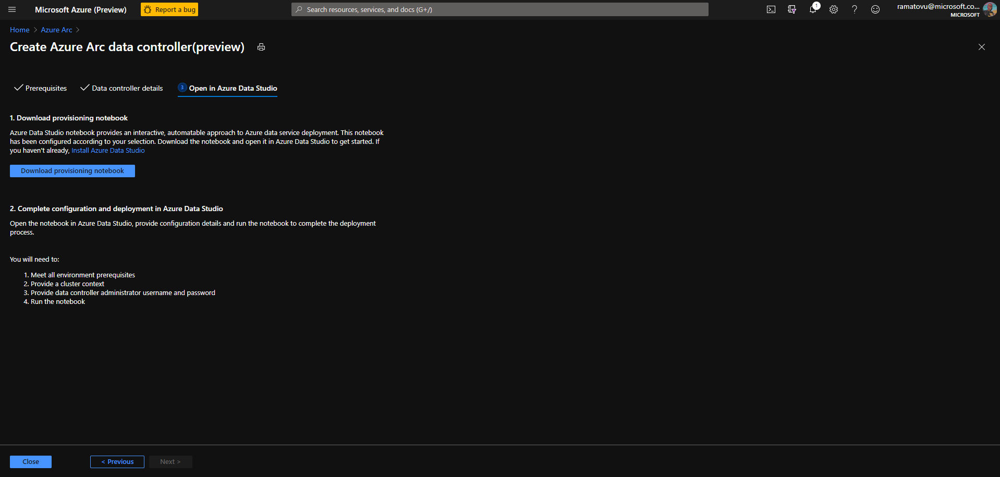

### Part 2: Deploy Azure Arc data controller

On your client (Desktop or VM), open the downloaded file in Azure Data Studio, then click the Run all button in the tool bar and follow instructions to deploy the Azure arc data controller. Note use storage class = default 

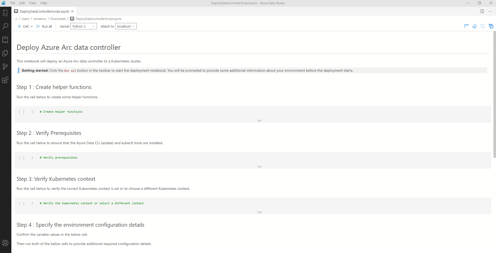

When Step 5 in the Jupyter Notebook is completed, you should see the data controller endpoint URL and a message that says "Data controller successfully deployed". 
The screenshot below shows the results from running step 5 of the Jupyter Notebook. Note: this process could take up to 30 minutes to complete as shown. 

The screenshot also shows a window of the command line results from listing pods in the cluster.

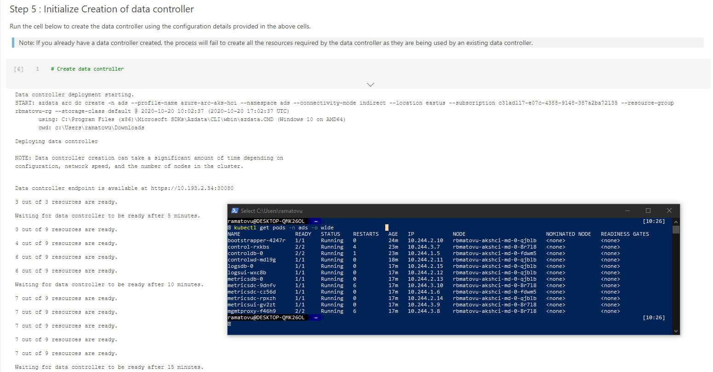

### Part 3: Create a SQL Managed Instance

After your Azure data controller deployment succeeds, Open Azure Data Studio and click on Connect Controller.

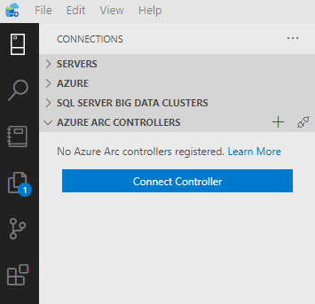

Enter the Controller URL, username and password you specified during Azure data controller deployment and click Connect. You should see the new controller listed in the Azure Arc Controller tab in Azure Data Studio. 

Right click on the new controller and select Manage. This will open the Azure Arc Data Controller Dashboard. In the toolbar, Click on New Instance to start creating a SQL Managed Instance

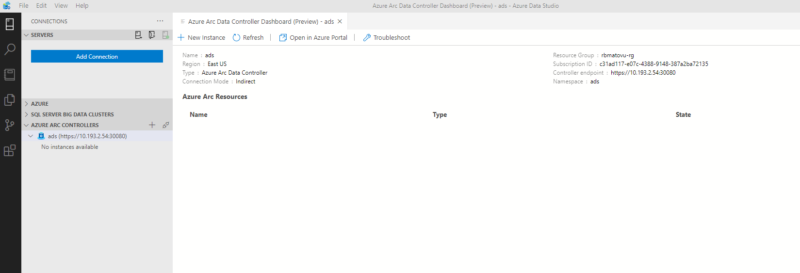

On the Deployment Options screen, choose Azure SQL Managed Instance - Azure Arc (Preview) tile from the list of options, accept the privacy and T&Cs statements and click Select

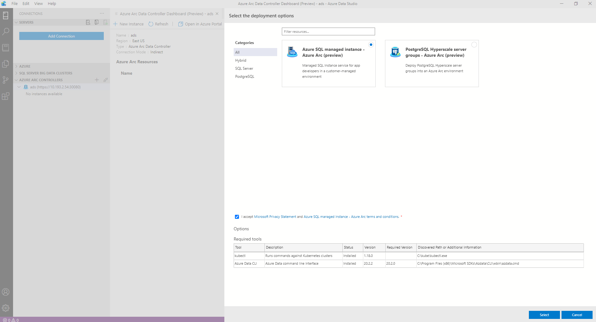

On the Provide Azure SQL managed Instance parameters, enter details of the SQL instance you want to create, then click on Deploy. 

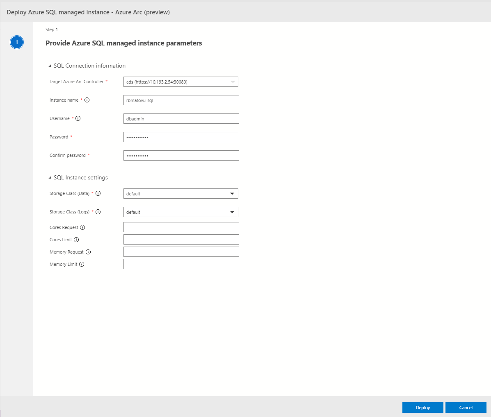

You should see a new Jupyter Notebook created and deployment of Azure SQL managed instance kicked off. When the deployment completes, you should see SQL Managed instance deployed on your cluster.

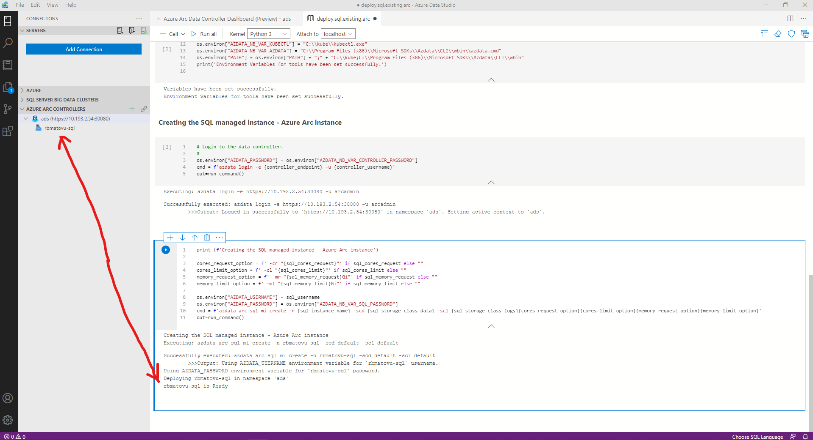

On success, you should see your SQL server databases listed in Azure Data Studio. You can also open the Grafana dashboard and Kibana logs using the listed endpoints.

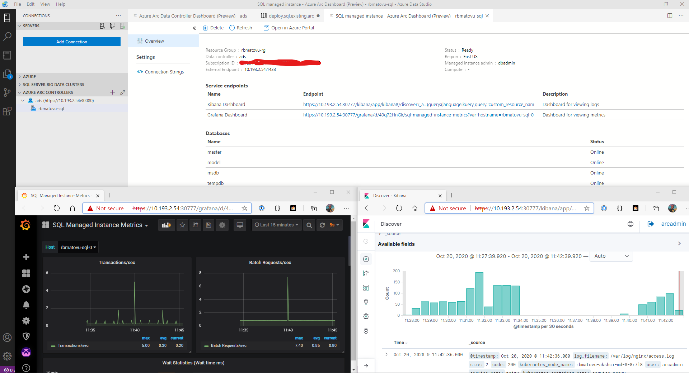

